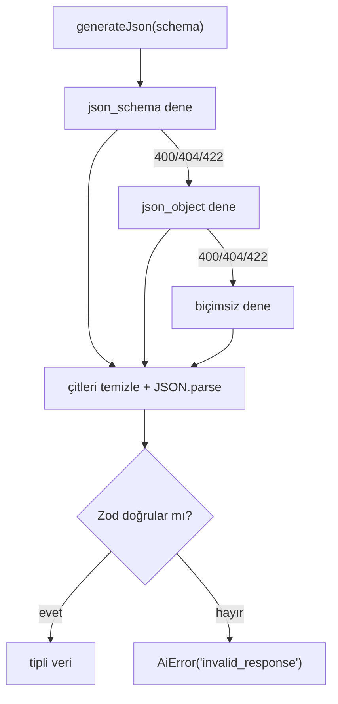

# Yapay Zekâ Entegrasyonu

**Son güncelleme:** 2026-08-20 · Karar: [ADR 0003](decisions/0003-yapay-zeka-saglayicisi.md)

---

## 1. Özet

Tüm çağrılar **OpenAI uyumlu** bir uç noktaya gider. Varsayılan sağlayıcı
OpenRouter; ama OpenAI, Azure, Together, yerel bir vLLM sunucusu — hepsi aynı
arayüzü konuştuğu için tek satır ayar değişikliğiyle geçilebilir.

## 2. Ortam değişkenleri

| Değişken          | Zorunlu   | Varsayılan                     | Açıklama               |
| ----------------- | --------- | ------------------------------ | ---------------------- |
| `AI_BASE_URL`     | hayır     | `https://openrouter.ai/api/v1` | OpenAI uyumlu uç nokta |
| `AI_API_KEY`      | **evet*** | —                              | Sağlayıcı anahtarı     |
| `AI_TEXT_MODEL`   | hayır     | `anthropic/claude-sonnet-4.5`  | Metin üretimi          |
| `AI_VISION_MODEL` | hayır     | `google/gemini-2.5-flash`      | Görsel tanıma          |

\* Tanımlı değilse yapay zekâ özellikleri kapanır (`aiEnabled()` false döner),
uygulamanın geri kalanı normal çalışır. Uçlar 503 döner, arayüz butonu gizler.

Anahtar **yalnızca sunucuda** okunur. `NEXT_PUBLIC_` öneki yoktur, istemci
paketine girmez.

## 3. Özellikler

| Özellik             | Uç                       | Model  | Günlük kota |
| ------------------- | ------------------------ | ------ | ----------- |
| Kitap kapağı tanıma | `POST /api/kapak-tani`   | görsel | 30          |
| Okuma raporu yorumu | `POST /api/rapor-yorumu` | metin  | 10          |

Kotalar `src/lib/ai/config.ts` içindeki `AI_QUOTAS` sabitinde; sayım
`ai_usage_events` tablosundan yapılır (sunucusuz ortamda bellek işe yaramaz).

## 4. Yapılandırılmış yanıt

Sağlayıcılar `response_format` desteğinde ayrışıyor. `generateJson()` üç
kademe dener ve ilk çalışanı kullanır:

1. `json_schema` — Zod şeması JSON Schema'ya çevrilip gönderilir (en katı)
2. `json_object` — yalnızca "JSON döndür" kısıtı
3. biçim kısıtı yok — istemdeki talimata güvenilir

Her durumda yanıt markdown çitlerinden temizlenir, `JSON.parse` edilir ve
**Zod ile doğrulanır**. Şemaya uymayan yanıt uygulamaya girmez; uç 502 döner.

## 5. Güvenlik ve maliyet

- Her uç **giriş yapmış kullanıcı** ister.
- Kullanıcı başına günlük kota; aşılırsa 429.
- Rapor yorumu istemciden gelen sayılara güvenmez: yalnızca `childId` alınır,
  istatistikler sunucuda kullanıcının kendi yetkisiyle (RLS) okunur. Böylece
  uydurma verilerle metin ürettirilemez.
- Görsel yüklemede boyut sınırı 4 MB; istemci tarafında ayrıca küçültülür.
- Her çağrı `ai_usage_events` tablosuna model ve token sayısıyla yazılır.

## 6. Model değiştirme

Yeniden yayın gerekmez; Vercel'de ortam değişkenini güncelleyip yeniden
dağıtım tetiklemek yeterli.

Görsel modeli seçerken: kapak fotoğrafındaki Türkçe metni okuyabilmeli.
Metin modeli seçerken: akıcı Türkçe yazabilmeli. İkisini ayrı tutmanın sebebi
bu — görsel iş ucuz bir modelle, metin işi kaliteli bir modelle yapılabilsin.

## 7. Yapay zekânın yapmadıkları

- Kitap **önerisi sıralaması** yapmaz. Sıralama `src/lib/recommendations.ts`
  içindeki deterministik motorun işidir; yapay zekâ yalnızca sonucu anlatan
  metni yazar (PRD ilke 5).
- Kitap verisi üretmez, katalog yazmaz.
- Kullanıcı verisini sağlayıcıya toplu göndermez; yalnızca ilgili çocuğun
  özet istatistikleri ve adı gider.
