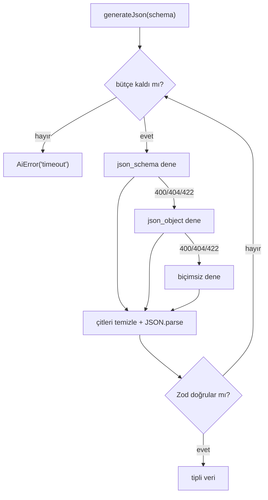

# Yapay Zekâ Entegrasyonu

**Son güncelleme:** 2026-08-20 · Karar: [ADR 0003](decisions/0003-yapay-zeka-saglayicisi.md)

---

## 1. Özet

Tüm çağrılar **OpenAI uyumlu** bir uç noktaya gider. Varsayılan sağlayıcı
OpenRouter; ama OpenAI, Azure, Together, yerel bir vLLM sunucusu — hepsi aynı
arayüzü konuştuğu için tek satır ayar değişikliğiyle geçilebilir.

## 2. Ortam değişkenleri

| Değişken               | Zorunlu   | Varsayılan                     | Açıklama                                           |
| ---------------------- | --------- | ------------------------------ | -------------------------------------------------- |
| `AI_BASE_URL`          | hayır     | `https://openrouter.ai/api/v1` | OpenAI uyumlu uç nokta                             |
| `AI_API_KEY`           | **evet*** | —                              | Sağlayıcı anahtarı                                 |
| `AI_TEXT_MODEL`        | hayır     | `anthropic/claude-sonnet-4.5`  | Metin üretimi                                      |
| `AI_VISION_MODEL`      | hayır     | `google/gemini-2.5-flash`      | Görsel tanıma                                      |
| `AI_STRUCTURED_OUTPUT` | hayır     | `auto`                         | `auto` \| `json_schema` \| `json_object` \| `none` |
| `AI_BUDGET_MS`         | hayır     | `35000`                        | Bir isteğe ayrılan toplam süre                     |

\* Tanımlı değilse yapay zekâ özellikleri kapanır (`aiEnabled()` false döner),
uygulamanın geri kalanı normal çalışır. Uçlar 503 döner, arayüz butonu gizler.

Anahtar **yalnızca sunucuda** okunur. `NEXT_PUBLIC_` öneki yoktur, istemci
paketine girmez.

## 3. Özellikler

| Özellik             | Uç                       | Model  | Günlük kota |
| ------------------- | ------------------------ | ------ | ----------- |
| Kitap kapağı tanıma | `POST /api/kapak-tani`   | görsel | 30          |
| Okuma raporu yorumu | `POST /api/rapor-yorumu` | metin  | 10          |

Kotalar `src/lib/ai/config.ts` içindeki `AI_QUOTAS` sabitinde; sayım
`ai_usage_events` tablosundan yapılır (sunucusuz ortamda bellek işe yaramaz).

## 4. Yapılandırılmış yanıt

Sağlayıcılar `response_format` desteğinde ayrışıyor. `generateJson()` üç
kademe dener ve ilk çalışanı kullanır:

1. `json_schema` — Zod şeması JSON Schema'ya çevrilip gönderilir (en katı)
2. `json_object` — yalnızca "JSON döndür" kısıtı
3. biçim kısıtı yok — istemdeki talimata güvenilir

Her durumda yanıt markdown çitlerinden temizlenir, `JSON.parse` edilir ve
**Zod ile doğrulanır**. Şemaya uymayan yanıt uygulamaya girmez; uç 502 döner.

### Zaman bütçesi

Kademeler SIRAYLA deneniyor, yani bir kullanıcı isteği birden çok sağlayıcı
çağrısı demek. Bu, üretimde 504'e yol açtı:

| Ayar               | Eski  | Yeni        |
| ------------------ | ----- | ----------- |
| Rota `maxDuration` | 45 sn | 60 sn       |
| İstek bütçesi      | yok   | 35 sn       |
| Çağrı zaman aşımı  | 45 sn | kalan bütçe |
| SDK `maxRetries`   | 2     | 0           |

Eskiden her çağrıya ayrı ayrı 45 sn veriliyordu ve SDK bunları 2 kez daha
deniyordu: en kötü ihtimalle 3 kademe × 3 deneme = **9 çağrı**. Rota sınırı
da 45 sn olduğu için fonksiyon, istemci zaman aşımından ÖNCE ölüyordu —
kullanıcı düzgün bir hata yerine 504 alıyordu.

Artık istek başına tek bütçe var; her kademe kalan süreyi alır, bütçe
biterse `AiError('timeout')` döner ve uç 504 yerine anlaşılır bir Türkçe
mesaj verir. `maxDuration` bütçeden bilerek büyük: cevabı hep biz veriyoruz.

### Desteklenmeyen biçimi hatırlama

Model `json_schema`'yı reddederse (400/404/422) bu, süreç ömrü boyunca
hatırlanır ve bir daha denenmez. Aksi halde her istek boşa bir tur atar.
Modelin desteğini biliyorsanız `AI_STRUCTURED_OUTPUT` ile kademeyi doğrudan
atlayabilirsiniz — en hızlısı budur.

### Sağlayıcı hataları

| Durum          | `AiError.code`     | Uç  | Kullanıcı ne görür                                  |
| -------------- | ------------------ | --- | --------------------------------------------------- |
| 429            | `rate_limited`     | 429 | "Servis şu anda yoğun, birkaç dakika sonra deneyin" |
| 401/402/403    | `unauthorized`     | 503 | "Bu özellik şu anda kullanılamıyor"                 |
| zaman aşımı    | `timeout`          | 504 | "Yavaş yanıt veriyor, biraz sonra deneyin"          |
| şemaya uymayan | `invalid_response` | 502 | "Üretilemedi, tekrar deneyin"                       |

429 ve 401/402/403 kalıcı durumlar; kademe değiştirmek çözmez, o yüzden
hemen çıkılır. **429 kullanıcının kendi günlük kotasıyla karıştırılmamalı** —
kota da 429 döner ama mesajı farklıdır ve `ai_usage_events` sayımından gelir.

Başarısız çağrılar kotadan düşmez: `ai_quota_remaining` yalnızca
`succeeded` satırları sayar.

### Model seçerken dikkat

- **Akıl yürüten ("reasoning") modeller:** düşünme jetonları `max_tokens`
  bütçesinden yenir; sınır düşükse `content` BOŞ döner. Kademe boşuna
  ilerler. Belirti: `finish_reason: "length"` ve boş içerik. Çözüm:
  `max_tokens` yükseltin ya da akıl yürütmeyen bir model seçin.
- **Yapılandırılmış çıktı desteği:** her model `json_schema` desteklemiyor.
  Desteklemeyen bir modelde `auto` her istekte bir kademe israf eder.

## 5. Güvenlik ve maliyet

- Her uç **giriş yapmış kullanıcı** ister.
- Kullanıcı başına günlük kota; aşılırsa 429.
- Rapor yorumu istemciden gelen sayılara güvenmez: yalnızca `childId` alınır,
  istatistikler sunucuda kullanıcının kendi yetkisiyle (RLS) okunur. Böylece
  uydurma verilerle metin ürettirilemez.
- Görsel yüklemede boyut sınırı 4 MB; istemci tarafında ayrıca küçültülür.
- Her çağrı `ai_usage_events` tablosuna model ve token sayısıyla yazılır.

## 6. Model değiştirme

Yeniden yayın gerekmez; Vercel'de ortam değişkenini güncelleyip yeniden
dağıtım tetiklemek yeterli.

Görsel modeli seçerken: kapak fotoğrafındaki Türkçe metni okuyabilmeli.
Metin modeli seçerken: akıcı Türkçe yazabilmeli. İkisini ayrı tutmanın sebebi
bu — görsel iş ucuz bir modelle, metin işi kaliteli bir modelle yapılabilsin.

## 7. Yapay zekânın yapmadıkları

- Kitap **önerisi sıralaması** yapmaz. Sıralama `src/lib/recommendations.ts`
  içindeki deterministik motorun işidir; yapay zekâ yalnızca sonucu anlatan
  metni yazar (PRD ilke 5).
- Kitap verisi üretmez, katalog yazmaz.
- Kullanıcı verisini sağlayıcıya toplu göndermez; yalnızca ilgili çocuğun
  özet istatistikleri ve adı gider.
