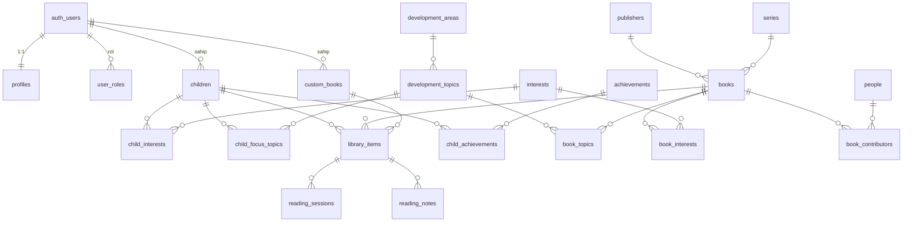
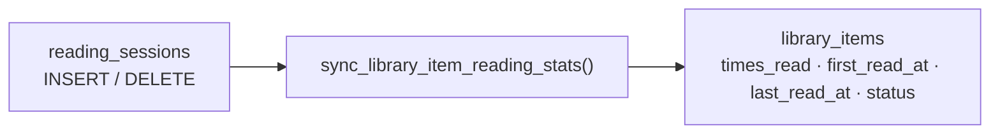

# Veri Modeli

**Son güncelleme:** 2026-08-20 · Kaynak: `supabase/migrations/`
İlgili kararlar: [ADR 0004](decisions/0004-kutuphane-modeli.md),
[ADR 0005](decisions/0005-veritabani-dili.md), [ADR 0006](decisions/0006-eski-surumden-ayrilma.md)

> Şemayı değiştirdikten sonra bu dosyayı ve `src/lib/supabase/database.types.ts`
> dosyasını güncelleyin (`npm run db:types`).

---

## 1. Genel şema



## 2. Migration dosyaları

| Dosya                     | Kurduğu                                                                                                                                      |
| ------------------------- | -------------------------------------------------------------------------------------------------------------------------------------------- |
| `0001_foundation`         | Uzantılar, arama yapılandırması, enum'lar, `set_updated_at`, `slugify`, `build_search_query`                                                 |
| `0002_roles`              | `user_roles`, `is_staff()`, `is_admin()`                                                                                                     |
| `0003_taxonomy`           | `development_areas`, `development_topics`, `interests`                                                                                       |
| `0004_catalog`            | `publishers`, `people`, `series`, `books`, ilişki tabloları, arama vektörü tetikleyicileri                                                   |
| `0005_accounts`           | `profiles`, `children`, `child_interests`, `child_focus_topics`, `owns_child()`                                                              |
| `0006_library`            | `custom_books`, `library_items`, `reading_sessions`, `reading_notes`, `achievements`, `child_achievements`, türetme ve başarım fonksiyonları |
| `0007_community`          | `feedback`, `donation_organizations`, `donation_requests`, `exchange_listings`                                                               |
| `0008_storage`            | `catalog-covers` ve `user-covers` kovaları + politikaları                                                                                    |
| `0009_views`              | `catalog_books`, `book_details`, `child_reading_stats`                                                                                       |
| `0010_ai_usage`           | `ai_usage_events`, `ai_quota_remaining()`                                                                                                    |
| `0011_grants`             | Tablo bazlı `GRANT`'ler (RLS tek başına yetmez — aşağıya bakın)                                                                              |
| `0012_trigger_privileges` | Türetilmiş alan tetikleyicilerini `security definer` yapar                                                                                   |
| `0013_function_hardening` | `search_path` sabitleme + iç fonksiyonları REST yüzeyinden çıkarma                                                                           |
| `0014_rls_performance`    | Politikalarda InitPlan optimizasyonu, `FOR ALL` ayrıştırma, FK indeksleri                                                                    |

Sıralı çalıştırılır; hiçbiri kendinden sonrakine atıfta bulunmaz.

### Uzantılar `extensions` şemasında

`pgcrypto`, `citext`, `unaccent`, `pg_trgm` — hepsi `public` yerine
`extensions` şemasına kurulur. Supabase'in yerleşik düzeni budur; `public`
içine kurmak güvenlik denetçisinin uyardığı bir durum. Pratik sonucu: bu
uzantılardan gelen her şey nitelenerek yazılır — `extensions.unaccent(...)`,
`extensions.citext`, `extensions.gin_trgm_ops`. Niteleme unutulursa migration
gerçek Supabase'de patlar ama yerel testte geçebilir.

## 3. Katalog tarafı

### `books`

Kataloğun merkezi. `slug` URL'de kullanılır ve kalıcıdır.

| Sütun                 | Not                                                                                       |
| --------------------- | ----------------------------------------------------------------------------------------- |
| `slug`                | `/kitap/caya-gelen-kaplan`                                                                |
| `age_min` / `age_max` | Yaş **aralık** olarak tutulur; "4+ yaş" gibi etiketler arayüzde üretilir                  |
| `status`              | `draft` / `published` / `archived` — yalnızca `published` herkese görünür                 |
| `search_vector`       | Tetikleyiciyle bakımı yapılır; başlık (A), yazar + alt başlık (B), özet (C), açıklama (D) |
| `instagram_shortcode` | Benzersiz; içerik dosyasıyla eşleştirmede anahtar                                         |
| `cover_path`          | Depolama yolu; boşsa arayüz tipografik kapak üretir                                       |

### Arama

`search_tr` yapılandırması **gövdeleme yapmaz**, yalnızca aksan sadeleştirir.
Türkçe eklemeli olduğu için sorgular önek eşleştirmesiyle kurulur:

```sql
select title from books
where search_vector @@ build_search_query('kardes');
-- "kardeş", "kardeşim", "kardeşlik", "kardeşinin" hepsi eşleşir
```

Gerekçe: snowball Türkçe gövdeleyicisi aynı kökten kelimeleri farklı
gövdelere indiriyordu (`kardeşinin` → `karde`, `kardeşlik` → `kardeslik`).

### Etiketleme

`book_topics.source` iki değer alır:

- `editorial` — içerik dosyasında elle yazılmış, senkronda yeniden yazılır
- `auto` — konu anahtar kelimelerinden çıkarılmış, editoryal etiketi ezmez

## 4. Kullanıcı tarafı

### `library_items` — "bugünkü durum"

Bir çocuğun bir kitapla ilişkisi. `book_id` **veya** `custom_book_id` dolu olur
(kısıtla garanti altında).

| Sütun                                         | Not                                                |
| --------------------------------------------- | -------------------------------------------------- |
| `status`                                      | `to_read` / `reading` / `read` / `abandoned`       |
| `rating`                                      | 0–5; 0 "puanlanmadı" demek, "okunmadı" demek değil |
| `times_read`, `first_read_at`, `last_read_at` | Tetikleyiciyle türetilir, elle yazılmaz            |

### `reading_sessions` — "her okuma olayı"

Çocuk kitaplarında tekrar okuma kuraldır; her okuma ayrı satırdır. Takvim,
seri (streak) ve "bu ay kaç okuma" hesapları buradan gelir.



Tetikleyici durumu yalnızca `to_read` veya `reading` iken `read` yapar;
kullanıcının elle seçtiği `abandoned` korunur.

### Başarımlar

`achievements.criteria` bir JSON nesnesi: `{"type": "...", "threshold": N}`.
Desteklenen türler: `books_read`, `sessions`, `streak_days`, `ratings`,
`favorites`, `notes`, `distinct_areas`.

`evaluate_child_achievements(child_id)` her okuma kaydından sonra çağrılır ve
yalnızca yeni kazanılanları ekler (tekrar çağırmak zararsızdır).

## 5. Satır bazlı güvenlik (RLS)

Her tabloda RLS açıktır. Politikalar üç yardımcıya dayanır:

| Fonksiyon                 | Ne yapar                                             |
| ------------------------- | ---------------------------------------------------- |
| `is_staff()`              | Kullanıcı editör veya yönetici mi?                   |
| `is_admin()`              | Kullanıcı yönetici mi?                               |
| `owns_child(uuid)`        | Bu çocuk profili kullanıcının mı?                    |
| `owns_library_item(uuid)` | Bu kütüphane kaydı kullanıcının bir çocuğuna mı ait? |

Hepsi `security definer`: politika içinden çağrıldıklarında RLS'e takılmasınlar
ve `user_roles` politikası kendini çağırıp özyinelemeye girmesin diye.

| Tablo grubu                               | Anonim            | Üye                              | Editör                 |
| ----------------------------------------- | ----------------- | -------------------------------- | ---------------------- |
| Taksonomi, başarım kataloğu               | oku               | oku                              | oku + yaz              |
| `books` ve ilişkileri                     | yayındakileri oku | yayındakileri oku                | hepsi + yaz            |
| `profiles`, `children`, kütüphane, notlar | —                 | yalnızca kendi                   | kendi                  |
| `exchange_listings`                       | —                 | aktifleri oku, kendi ilanını yaz | hepsi                  |
| `feedback`, `donation_requests`           | —                 | kendi kaydını yaz ve oku         | hepsi + durum güncelle |

### RLS yetmez: GRANT de gerekir

RLS "hangi **satırlar**" sorusunu cevaplar; `GRANT` "bu role bu tabloya hiç
dokunma izni var mı" sorusunu. Politikası olan ama izni olmayan tablo
`permission denied` verir. İzinler `0011_grants.sql` içinde tablo tablo
verilmiştir; şema testi `has_table_privilege` ile bunu doğrular.

### Tetikleyiciler ve silme zinciri

Türetilmiş alanları güncelleyen tetikleyiciler `security definer`'dır
(`0012`). Sebebi: bir kullanıcı silindiğinde işlem `supabase_auth_admin`
rolüyle yapılır, zincirleme silme `reading_sessions` tablosuna dokunur ve bu
rolün `public` şemasında izni yoktur. Definer olmasaydı hesap silme —
Supabase panelinden bile — hata verirdi.

### Fonksiyon yüzeyi

PostgREST `public` şemasındaki **her** fonksiyonu `/rest/v1/rpc/<ad>` altında
yayımlar; PostgreSQL de her yeni fonksiyona varsayılan olarak `PUBLIC` için
`EXECUTE` verir. İkisi birleşince tetikleyici gövdeleri bile dışarıdan
çağrılabilir hale geliyordu. `0013` bunları geri alır.

Bilinçli olarak açık bırakılanlar: `is_staff()`, `is_admin()`, `owns_child()`,
`owns_library_item()`. Bunlar RLS politikalarının **içinden** çağrılıyor;
politika ifadesi sorgulayan rolün yetkisiyle değerlendirildiği için EXECUTE
geri alınırsa katalog sayfası komple kırılır. Üçü de yalnızca çağıranın kendi
durumunu döndürür.

### Politikalarda InitPlan

Politika ifadesindeki `auth.uid()` ve `is_staff()` çağrıları **her satır için**
yeniden çalışır. `(select auth.uid())` biçiminde sarınca PostgreSQL bunu bir
InitPlan'a çevirip sorgu başına bir kez hesaplar (`0014`). `is_staff()` için
kazanç daha da büyük: o çağrı `user_roles` tablosuna gidiyor.

`owns_child(child_id)` bilinçli olarak sarılmadı — argümanı satırdan geldiği
için ilişkili (correlated) alt sorgu olur, InitPlan'a dönüşmez.

Yalıtım `supabase/tests/schema_test.sql` içinde doğrulanır: iki ayrı ebeveyn,
bir editör ve anonim ziyaretçi ile 50+ iddia. Ayrıca `npm run test:e2e`
gerçek Supabase yığınına karşı 25 iddia çalıştırır.

## 6. Görünümler

| Görünüm               | Kullanım                                                 |
| --------------------- | -------------------------------------------------------- |
| `catalog_books`       | Ana sayfa; yazar, konu ve alan slug'ları dizi olarak     |
| `book_details`        | Kitap sayfası; katkıda bulunanlar ve konular JSON olarak |
| `child_reading_stats` | Rapor özetleri                                           |

Hepsi `security_invoker = on` ile tanımlıdır — yani çağıran kullanıcının
yetkisiyle çalışır ve alttaki tabloların RLS'i geçerli kalır. Bu olmadan
görünümler RLS'i baypas eder ve taslak kitaplar herkese görünürdü.

## 7. Şemayı değiştirme

1. `supabase/migrations/` altına **yeni** bir dosya ekle (mevcut dosyaları
   düzenleme — onlar zaten çalıştırıldı).
2. `npm run db:test` — yerel Postgres'te sıfırdan kurulum + testler.
3. `supabase/tests/schema_test.sql` içine yeni davranışın testini ekle.
4. `npm run db:local` ile şemayı ayakta tut, `npm run db:types` ile tipleri üret.
5. Bu dosyayı güncelle.
